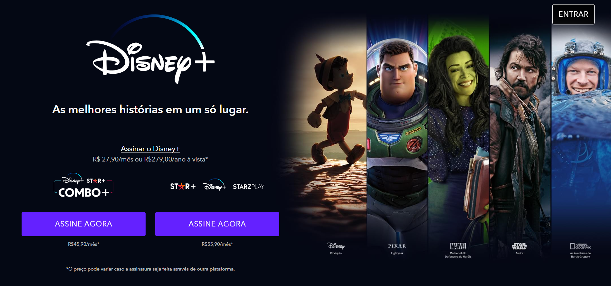

<h1 align="center">
Disney- A versão não oficial da landpage do Disney+
</h1>

    

  <a href="#tecnologias">Tecnologias</a>&nbsp;&nbsp;&nbsp;|&nbsp;&nbsp;&nbsp;
  <a href="#projeto">Projeto</a>&nbsp;&nbsp;&nbsp;|&nbsp;&nbsp;&nbsp;
  <a href="#desafio">Desafio</a>&nbsp;&nbsp;&nbsp;|&nbsp;&nbsp;&nbsp;
  <a href="#o-que-aprendi">O que aprendi</a>&nbsp;&nbsp;&nbsp;&nbsp;&nbsp;&nbsp;

## 🚀 Tecnologias

Esse projeto foi desenvolvido com as seguintes tecnologias:

- HTML
- sass
- JavaScript
- Gulp e plugins
- Git e Github

## Projeto

Como uma landpage para um site de streaming, o desafio principal é passar todas as informações dos planos, conteudos e informações sobre o serviço, tendo como principal base o site da <a href="https://www.disneyplus.com/pt-br"> disney+ </a> (versões anteriores do que o atual)

## Desafio

Como parte de um exercicio, o desenvolvedor deve ser capaz de:

- Criar um layout responsivo e mais próxima da original
- Criar uma de paineis, onde mostra os filmes de acordo com a opção selecionada
- Recriar todos os estados de hover e elementos ativos conforme site original

Veja o resultado através do <a href="https://disney-three-murex.vercel.app/">link do Vercel</a>

## O que aprendi

Com o objetivo de praticas mais a estruturação do css, com sass:

- Criar layouts responsivos com sass e a organiza-lo
- Utilizar a metodologia BEM para estruturar os nomes das classes e utiliza-las junto com o pré-processador  
- Seguir o design concebido para conseguir o resultado proposto
